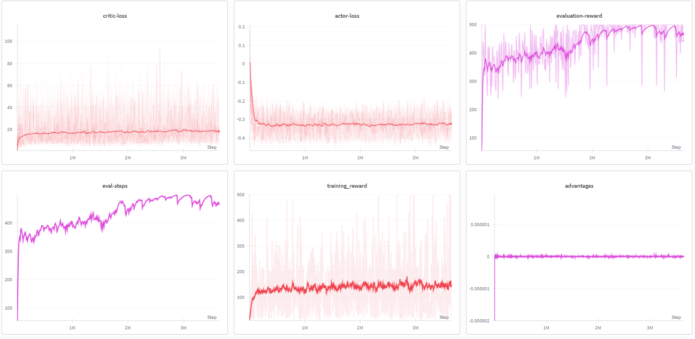

# Advantage Actor–Critic (A2C) — Vanilla Implementation

> A minimalistic, from-scratch implementation of the **Advantage Actor–Critic (A2C)** algorithm trained on **CartPole-v1** using PyTorch and tracked with **Weights & Biases**.

---

## 📌 Overview

This implementation covers the **core vanilla A2C logic** — no extras, no tricks. The goal is to understand the fundamental mechanics of the actor-critic framework before layering on advanced components like GAE, entropy bonuses, or multi-step returns.

| Property | Detail |
|---|---|
| **Algorithm** | Advantage Actor–Critic (A2C) |
| **Environment** | `CartPole-v1` (Gymnasium) |
| **Bootstrapping** | 1-step TD target — `r + γ·V(s')` |
| **Returns** | TD(0)-style (no Monte Carlo, no GAE) |
| **Entropy Bonus** | ❌ Not used |
| **Multi-step Returns** | ❌ Not used |
| **Update Style** | Full episode collected → single batch update |
| **Experiment Tracking** | Weights & Biases (W&B) |

---

## 🧠 Algorithm Design

### How it works — step by step

**1. Episode Rollout**
The agent interacts with the environment for a full episode, collecting `(state, action, reward, next_state, done, log_prob)` tuples at every timestep.

**2. TD Target (Critic's Label)**
After the episode, the 1-step TD target is computed for every timestep:

$$\hat{y}_t = r_t + \gamma \cdot V(s_{t+1}) \cdot (1 - \text{done}_t)$$

The `(1 - done)` mask correctly zeros out the bootstrap value at terminal states.

**3. Advantage Estimation**
The advantage measures how much better the taken action was compared to what the critic expected on average:

$$A_t = \hat{y}_t - V(s_t)$$

Advantages are then **normalized** (mean subtracted, divided by std) for training stability.

**4. Actor Loss (Policy Gradient)**
The actor is trained to increase the log-probability of actions that had positive advantage:

$$\mathcal{L}_{\text{actor}} = -\mathbb{E}_t \left[ \log \pi(a_t | s_t) \cdot A_t^{\text{detach}} \right]$$

The advantage is **detached** from the computation graph — the actor's gradient should not flow through the critic.

**5. Critic Loss (Value Regression)**
The critic is trained to minimize MSE between its prediction and the TD target:

$$\mathcal{L}_{\text{critic}} = \mathbb{E}_t \left[ \left( V(s_t) - \hat{y}_t^{\text{detach}} \right)^2 \right]$$

The TD target is also detached here — we don't want the target itself to be a moving part during the critic update.

---

## 🏗️ Network Architecture

Both actor and critic are **independent MLPs** with the same backbone depth.

```
Input (4,) → Linear(200) → ReLU → Linear(200) → ReLU → Linear(128) → ReLU → Output
```

| Network | Output | Activation |
|---|---|---|
| **Actor** | `action_dim` logits → Softmax → Categorical distribution | Softmax |
| **Critic** | Scalar state value `V(s)` | None (linear) |

**Total Parameters:**
- Actor: ~95k parameters
- Critic: ~94k parameters

---

## ⚙️ Hyperparameters

| Hyperparameter | Value |
|---|---|
| `gamma` (discount factor) | `0.99` |
| `actor_lr` | `2.5e-4` |
| `critic_lr` | `2.5e-4` |
| `optimizer` | AdamW |
| `n_rollouts` | `100,000` episodes |
| `eval_steps` | Every `10,000` global steps |
| `eval_loops` | `3` episodes (averaged) |
| `record_video` | Every `500,000` global steps |
| `device` | CUDA if available, else CPU |

---

## 📊 W&B Training Logs

All runs are tracked with Weights & Biases. The logged metrics include:

| Metric | Description |
|---|---|
| `training_reward` | Total reward per training episode |
| `training-step` | Number of steps per training episode |
| `evaluation-reward` | Avg reward over 3 eval episodes (greedy policy) |
| `eval-steps` | Avg steps per eval episode |
| `actor-loss` | Policy gradient loss (should decrease and stabilize) |
| `critic-loss` | MSE value loss (should decrease monotonically) |
| `advantages` | Mean advantage per batch (centered around 0 after normalization) |
| `global-steps` | Total environment interaction steps |

### Training Dashboard



> The W&B dashboard above shows the learning curves across global steps for all tracked metrics.

---

## 📁 Repository Structure

```
A2C/
├── a2c_cartpole.ipynb     # Main training notebook
├── static/
│   └── wandblogged.png    # W&B training dashboard screenshot
└── README.md
```

---

## 🚀 Getting Started

### 1. Install Dependencies

```bash
pip install torch gymnasium ale-py wandb tqdm
```

### 2. Set your W&B API key

Inside the notebook, replace the empty string in `wandb.login(key="")` with your W&B API key.

### 3. Run the Notebook

Open and run `a2c_cartpole.ipynb` top to bottom. Training will begin immediately and logs will appear on your W&B dashboard.

---

## 🔍 Key Implementation Notes

- **Why detach the advantage for the actor?** The actor loss uses `Advantages.detach()` because we want the actor's gradient to only update the actor's weights. Without detaching, the gradient would flow through `V(s_t)` into the critic — causing unintended coupled updates.

- **Why normalize advantages?** Raw advantage values can vary wildly in scale across episodes. Normalizing them to zero-mean and unit-variance stabilizes gradient magnitudes and makes learning more consistent.

- **Why separate optimizers?** Using separate `AdamW` instances for the actor and critic gives each network its own adaptive learning rate state, allowing them to learn at different effective rates even with the same nominal `lr`.

- **What's commented out?** The Monte Carlo return computation (`all_Gt`) is intentionally commented out. It was the original approach before switching to TD(0) bootstrapping, and is preserved for reference.

---

## 🔗 Related

- 📦 Full Repo: [reinforcement-learning-agents](https://github.com/ajheshbasnet/reinforcement-learning-agents)
- 📄 Paper: [Asynchronous Methods for Deep Reinforcement Learning (Mnih et al., 2016)](https://arxiv.org/abs/1602.01783)

---

## 👤 Author

**Ajhesh Basnet**
- GitHub: [@ajheshbasnet](https://github.com/ajheshbasnet)
- W&B Entity: `ajheshbasnet-kpriet`
