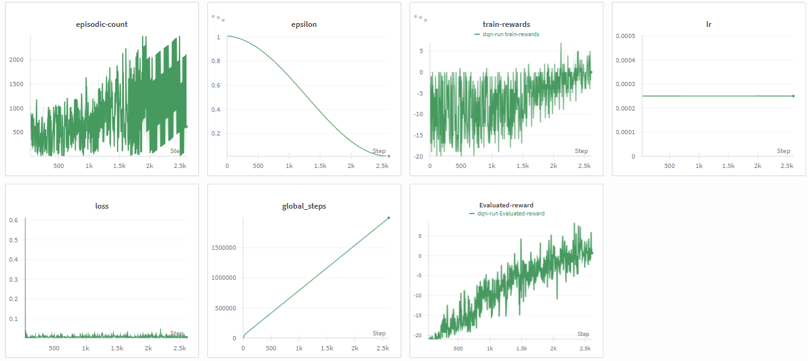

# Deep Q-Network (DQN) — Pong (ALE/Pong-v5)

> A research-grade PyTorch implementation of **Double DQN** trained on **Pong** from the Arcade Learning Environment (ALE), featuring convolutional Q-networks, frame stacking, reward clipping, Kaiming weight initialization, and a cosine-annealed epsilon-greedy exploration schedule — fully tracked with **Weights & Biases**.

---

## 📌 Overview

| Property | Detail |
|---|---|
| **Algorithm** | Double DQN |
| **Environment** | `ALE/Pong-v5` (Gymnasium + ALE) |
| **Observation** | 84×84 grayscale frames, stacked 4 deep |
| **Frame Skip** | 4 (action repeated over 4 frames) |
| **Bootstrapping** | 1-step Double TD target |
| **Exploration** | Cosine annealing ε-greedy (1.0 → 0.01) |
| **Replay Buffer** | ✅ Experience Replay (capacity: 1,000,000) |
| **Target Network** | ✅ Hard update every 4,000 steps (`τ=1.0`) |
| **Reward Clipping** | ✅ `np.sign(reward)` → {−1, 0, +1} |
| **Weight Init** | ✅ Kaiming Normal (conv + linear) |
| **Experiment Tracking** | Weights & Biases (W&B) |

---

## 🧠 Algorithm: Double DQN

This implementation uses **Double DQN**, not vanilla DQN. The difference is subtle but critical.

### Vanilla DQN TD Target (overestimates Q):
$$\hat{y}_t = r_t + \gamma \cdot \max_{a'} Q_{\text{target}}(s_{t+1}, a')$$

The same network both **selects** and **evaluates** the best action — this causes systematic overestimation.

### Double DQN TD Target (used here):
$$\hat{y}_t = r_t + \gamma \cdot Q_{\text{target}}\!\left(s_{t+1},\; \underbrace{\arg\max_{a'} Q_{\text{online}}(s_{t+1}, a')}_{\text{online selects action}}\right)$$

- **Online network** selects which action is best at `s'`
- **Target network** evaluates how good that action actually is

This decouples selection from evaluation, significantly reducing overestimation bias and improving training stability on complex environments like Pong.

---

## 🏗️ Network Architecture

```
Input: (B, 4, 84, 84)  ← 4 stacked grayscale frames, normalized ÷ 255

Conv1:  in=4,  out=32,  kernel=5×5, stride=4  → ReLU
Conv2:  in=32, out=64,  kernel=4×4, stride=3  → ReLU
Conv3:  in=64, out=64,  kernel=3×3, stride=1  → ReLU

Flatten → (B, 1024)

Linear(1024 → 512)  → ReLU
Linear(512  → 6)    ← Q-value for each of 6 discrete actions
```

| Layer | Output Shape | Parameters |
|---|---|---|
| Conv1 | (B, 32, 20, 20) | ~2,432 |
| Conv2 | (B, 64, 6, 6) | ~131,136 |
| Conv3 | (B, 64, 4, 4) | ~36,928 |
| Flatten | (B, 1024) | — |
| Linear 1 | (B, 512) | ~524,800 |
| Linear 2 | (B, 6) | ~3,078 |
| **Total** | — | **~1.76M params** |

> Pixel normalization (`x / 255.0`) is done **at runtime inside the forward pass**, not during storage — this keeps the replay buffer in `uint8`-equivalent range and avoids the ~4× memory overhead of storing `float32` frames.

---

## ⚙️ Hyperparameters

| Hyperparameter | Value | Note |
|---|---|---|
| `MAX_EPISODES` | `2,000,000` | Total environment steps |
| `N_STEP` | `10,000` | Max steps per episode |
| `LR` | `2.5e-4` | AdamW learning rate |
| `BATCH_SIZE` | `64` | Mini-batch size |
| `STACK_SIZE` | `4` | Frame stack depth |
| `MEMORY_MAX_LENGTH` | `1,000,000` | Replay buffer capacity |
| `TRAINING_START_STEPS` | `65,000` | Steps before first gradient update |
| `TRAINING_FREQ` | `4` | Update online network every N steps |
| `UPDATION_STEP` | `4,000` | Hard sync target ← online |
| `DISCOUNTED_FACTOR` | `0.99` | γ |
| `tau` | `1.0` | Hard copy (not soft update) |
| `EVAL_STEPS` | `3,000` | Evaluate every N steps |
| `EVAL_LOOPS` | `3` | Episodes averaged per eval |
| `SAVE_VIDEO_STEP` | `100,000` | Record video every N steps |

---

## 🔑 Key Design Decisions

### 1. Frame Stacking (4 frames)
A single grayscale frame gives the agent no velocity information — it can't tell which direction the ball is moving. Stacking 4 consecutive frames `[t-3, t-2, t-1, t]` gives the network implicit motion information without requiring recurrence.

### 2. Reward Clipping
```python
reward = np.sign(reward)  # maps reward → {-1, 0, +1}
```
Raw Pong scores can be +21 or -21. Clipping to `{-1, 0, +1}` keeps gradient magnitudes consistent across different Atari games and stabilizes Q-value scales. This is standard DeepMind DQN practice.

### 3. Kaiming Normal Initialization
```python
torch.nn.init.kaiming_normal_(m.weight, nonlinearity="relu")
torch.nn.init.constant_(m.bias, 0.0)
```
ReLU kills half of activations at initialization. Kaiming initialization compensates by scaling weights to maintain variance through ReLU layers — preventing vanishing/exploding gradients from the first forward pass.

### 4. Cosine Annealing Epsilon
$$\varepsilon_t = \varepsilon_{\min} + 0.5 \cdot (\varepsilon_{\max} - \varepsilon_{\min}) \cdot \left(1 + \cos\left(\frac{\pi \cdot t}{T_{\max}}\right)\right)$$

Epsilon decays smoothly from `1.0` → `0.01` over training. Compared to linear decay, cosine annealing keeps exploration higher for longer early in training (when the replay buffer is still filling up and the policy is still poor) and converges sharply near the end.

### 5. Training Start Delay
The agent collects **65,000 transitions** before the first gradient update. This ensures the replay buffer has enough diverse experience to sample meaningful, decorrelated mini-batches from day one — preventing the network from overfitting to a narrow early distribution.

### 6. Frozen Target Network (No Gradients)
```python
targetNetwork.eval()
for p in targetNetwork.parameters():
    p.requires_grad = False
```
The target network is explicitly frozen with `requires_grad=False`. Its parameters are only updated via hard copy every 4,000 steps. This is more memory and compute efficient than calling `.detach()` at every step.

---

## 📊 W&B Training Logs

All metrics are tracked live on **Weights & Biases** under project `pingpong`.

| Metric | Logged When | Description |
|---|---|---|
| `epsilon` | Every 2,000 global steps | Current exploration rate |
| `train-rewards` | Every 2,000 global steps | Cumulative clipped reward since last reset |
| `loss` | Every 2,000 global steps (post training-start) | MSE between Q-online and Double DQN target |
| `lr` | Every 2,000 global steps | Current learning rate from optimizer |
| `episodic-count` | Every 2,000 global steps | Episodes completed so far |
| `Evaluated-reward` | Every 3,000 global steps | Avg reward over 3 greedy eval episodes |
| `global_steps` | Every 2,000 global steps | Total env interaction steps |
| `mean_q / max_q` | Every 100,000 global steps | Q-value health checks (printed to console) |

### Training Dashboard



> The W&B dashboard above shows learning curves across global steps — covering loss convergence, evaluation reward growth, epsilon decay, and Q-value trends throughout training.

---

## 🔁 Training Loop — Step by Step

```
For each global step:
  1. ε-greedy action selection (cosine annealed)
  2. Step environment → (next_obs, reward, done)
  3. Clip reward → np.sign(reward)
  4. Store (s, a, r, s', done) in replay buffer (maxlen=1M)
  5. If step >= 65,000 AND step % 4 == 0:
       a. Sample 64 transitions from buffer
       b. Online net selects best action at s'
       c. Target net evaluates Q(s', best_action)  ← Double DQN
       d. Compute TD target: r + γ·Q_target·(1-done)
       e. Compute MSE loss: Q_online(s,a) vs target
       f. Backward + AdamW step
  6. If step % 4,000 == 0: hard sync target ← online
  7. If step % 3,000 == 0: run greedy evaluation (3 eps)
  8. If done: reset env, reset episode counters
```

---

## 🚀 Getting Started

### Install Dependencies

```bash
git clone https://github.com/ajheshbasnet/reinforcement-learning-agents.git
cd reinforcement-learning-agents/Pong-DQN
pip install torch numpy gymnasium[atari] ale-py wandb tqdm
```

### Install ALE ROMs

```bash
pip install autorom
autorom --accept-license
```

### Train

```python
# Set your W&B key inside create_run()
wandb.login(key="YOUR_API_KEY")

python pong_dqn.py
```

Trained weights are saved to `weights.pt` after the run completes.

### Evaluate

```python
onlineNetwork.load_state_dict(torch.load("weights.pt"))
evaluationLoop(onlineNetwork, recordVideo=True)
# Videos saved to videos/
```

---

## 📁 Project Structure

```
Pong-DQN/
├── stc
|     └── pong_dqn.py          # Full training + evaluation script
├── weights.pt           # Saved model weights (post-training)
├── videos/              # Recorded evaluation episodes
└── static/
    └── wandb.png        # W&B training dashboard screenshot
```

---

## 📈 Expected Performance

| Metric | Value |
|---|---|
| **Human baseline** | ~9.3 |
| **Random agent** | ~−20.7 |
| **DQN (DeepMind, 2015)** | ~18.9 |
| **Target (this impl.)** | ≥ +5 consistent eval reward |

> Pong is considered solved when the agent consistently wins (score > 0). Training typically takes 1–3M steps depending on hardware and hyperparameter tuning.

---

## 🔗 Related

- 📦 Full Repo: [reinforcement-learning-agents](https://github.com/ajheshbasnet/reinforcement-learning-agents)
- 📄 Original DQN Paper: [Mnih et al., 2015 — Human-level control through deep reinforcement learning](https://www.nature.com/articles/nature14236)
- 📄 Double DQN Paper: [van Hasselt et al., 2015 — Deep Reinforcement Learning with Double Q-learning](https://arxiv.org/abs/1509.06461)

---

## 👤 Author

**Ajhesh Basnet**
- GitHub: [@ajheshbasnet](https://github.com/ajheshbasnet)
- W&B Project: `ajheshbasnet-kpriet/pingpong`
