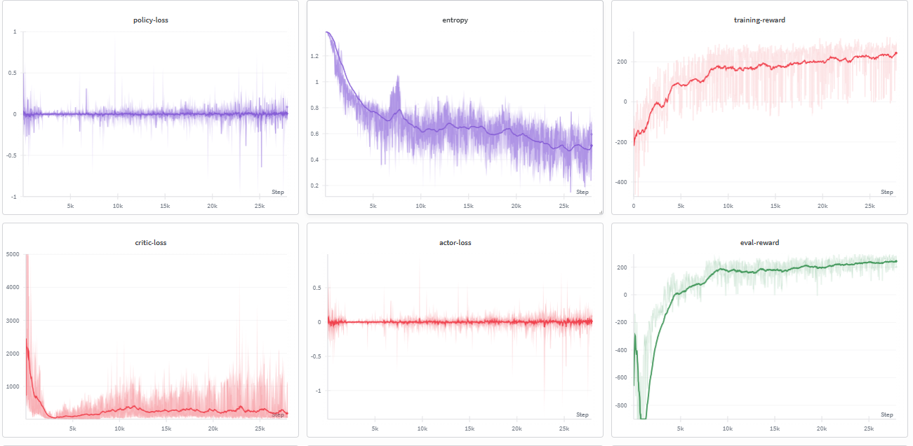
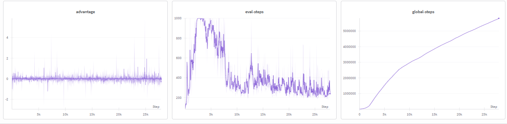

# Proximal Policy Optimization (PPO) — LunarLander-v3

A clean PyTorch implementation of **Proximal Policy Optimization (PPO)** trained on the `LunarLander-v3` continuous control environment from OpenAI Gymnasium. The implementation covers the full PPO pipeline: GAE-based advantage estimation, clipped surrogate objective, entropy regularization, and mini-batch epoch updates — tracked end-to-end with Weights & Biases.

---

## Overview

| Property | Detail |
|---|---|
| **Algorithm** | Proximal Policy Optimization (PPO) |
| **Environment** | `LunarLander-v3` (Gymnasium Box2D) |
| **Advantage Estimation** | Generalized Advantage Estimation (GAE) |
| **Policy Objective** | Clipped surrogate (PPO-Clip) |
| **Entropy Regularization** | Yes — coefficient `0.001` |
| **Update Style** | Full episode rollout → shuffled mini-batch epochs |
| **Optimizer** | AdamW (separate actor and critic) |
| **Experiment Tracking** | Weights & Biases (W&B) |

---

## Algorithm Design

### Why PPO over vanilla Policy Gradient?

Vanilla REINFORCE and A2C apply gradient updates that can be arbitrarily large. If the new policy deviates too far from the old one, the update destabilizes training — often catastrophically and irreversibly. PPO solves this by explicitly constraining how much the policy is allowed to change per update using a clipped probability ratio.

### The Clipped Surrogate Objective

After collecting a full episode rollout under the **old policy** (frozen `log_probs`), PPO reuses that data for multiple mini-batch updates. The ratio between the new and old policy is:

$$r_t(\theta) = \frac{\pi_\theta(a_t \mid s_t)}{\pi_{\theta_{\text{old}}}(a_t \mid s_t)} = \exp\!\left(\log\pi_\theta(a_t|s_t) - \log\pi_{\theta_{\text{old}}}(a_t|s_t)\right)$$

The clipped loss prevents this ratio from moving too far from 1 in either direction:

$$\mathcal{L}^{\text{CLIP}}(\theta) = -\mathbb{E}_t\!\left[\min\!\left(r_t(\theta)\,A_t,\;\text{clip}(r_t(\theta),\,1-\varepsilon,\,1+\varepsilon)\,A_t\right)\right]$$

where `ε = 0.2`. This means the policy update is clamped: if the ratio strays outside `[0.8, 1.2]`, the gradient contribution from that sample is zeroed out.

### Entropy Regularization

The full actor loss adds an entropy bonus to discourage premature convergence to a deterministic policy:

$$\mathcal{L}^{\text{actor}}(\theta) = \mathcal{L}^{\text{CLIP}}(\theta) - \beta \cdot \mathbb{E}_t\!\left[\mathcal{H}[\pi_\theta(\cdot \mid s_t)]\right]$$

where `β = 0.001`. Higher entropy = more exploration. The minus sign means maximizing entropy is achieved by minimizing the negative entropy term.

### Generalized Advantage Estimation (GAE)

Rather than using raw TD residuals or full Monte Carlo returns, PPO uses GAE to trade off bias vs. variance in the advantage estimate:

$$\delta_t = r_t + \gamma \cdot V(s_{t+1}) \cdot (1 - d_t) - V(s_t)$$

$$A_t^{\text{GAE}} = \sum_{l=0}^{T-t-1} (\gamma\lambda)^l \,\delta_{t+l}$$

The recursion implemented in code (backwards pass):

$$\text{gae} = \delta_t + \gamma \lambda (1 - d_t) \cdot \text{gae}_{t+1}$$

With `γ = 0.99` and `λ = 0.96`:
- Setting `λ = 0` recovers pure 1-step TD (low variance, high bias)
- Setting `λ = 1` recovers full Monte Carlo returns (high variance, low bias)
- `λ = 0.96` is a well-calibrated middle ground used widely in PPO literature

### Value Target (Returns)

$$\hat{R}_t = A_t^{\text{GAE}} + V(s_t)$$

The critic is trained to regress toward these returns using MSE loss:

$$\mathcal{L}^{\text{critic}} = \mathbb{E}_t\!\left[\left(V_\phi(s_t) - \hat{R}_t\right)^2\right]$$

---

## Network Architecture

Both actor and critic are independent MLPs. The actor outputs raw logits over the discrete action space; the critic outputs a scalar state value.

```
Input (8,) → Linear(512) → ReLU → Linear(256) → ReLU → Output
```

| Network | Output | Head |
|---|---|---|
| Actor | `action_dim` logits → Categorical distribution | Discrete softmax |
| Critic | Scalar `V(s)` | Linear (no activation) |

**Parameter Count**
- Actor: `8×512 + 512×256 + 256×4` = ~136k parameters
- Critic: `8×512 + 512×256 + 256×1` = ~133k parameters

---

## Hyperparameters

| Hyperparameter | Value | Role |
|---|---|---|
| `n_rollouts` | `25,000` | Number of full episode rollouts |
| `batch_size` | `96` | Mini-batch size for PPO epoch updates |
| `actor_lr` | `1e-4` | AdamW LR for actor |
| `critic_lr` | `1e-4` | AdamW LR for critic |
| `gamma` | `0.99` | Discount factor |
| `lambda_` | `0.96` | GAE smoothing parameter |
| `ppo_r_clamp` (ε) | `0.2` | PPO clip range |
| `entropy_beta` (β) | `0.001` | Entropy regularization coefficient |
| `eval_steps` | `10` | Evaluate every N rollouts |
| `eval_loops` | `3` | Episodes averaged per evaluation |
| `record_video` | `500,000` | Record video every N global steps |

---

## W&B Training Logs

All metrics are tracked live on Weights & Biases. The following metrics are logged per rollout:

| Metric | Logged When | Description |
|---|---|---|
| `training-reward` | Every rollout | Total undiscounted reward for the training episode |
| `training-step` | Every rollout | Number of timesteps in the training episode |
| `global-steps` | Every rollout | Total environment interaction steps |
| `policy-loss` | Every rollout (avg over mini-batches) | Raw clipped surrogate loss, without entropy term |
| `actor-loss` | Every rollout (avg over mini-batches) | Full actor loss = policy-loss − β·entropy |
| `critic-loss` | Every rollout (avg over mini-batches) | MSE between critic output and GAE returns |
| `entropy` | Every rollout (avg over mini-batches) | Mean policy entropy — should stay positive throughout |
| `advantage` | Every rollout | Mean advantage across last mini-batch |
| `eval-reward` | Every 10 rollouts | Avg reward over 3 greedy (argmax) eval episodes |
| `eval-steps` | Every 10 rollouts | Avg episode length during evaluation |

### Training Dashboard

**Run 1 — Learning Curves**



**Run 2 — Learning Curves**



> The dashboards show training reward growth, policy and critic loss convergence, entropy decay, and evaluation reward across rollouts.

---

## Training Loop — Step by Step

```
For each of n_rollouts:

  Phase 1 — Rollout Collection (no gradient)
    1. Reset environment, collect full episode
    2. At each step: sample action from Categorical(logits)
    3. Store (s, a, r, s', done, log_prob_old)

  Phase 2 — Advantage Computation (no gradient)
    4. Compute V(s) and V(s') for all timesteps via critic
    5. Compute TD residuals: δ_t = r_t + γ·V(s')·(1-done) − V(s)
    6. Compute GAE advantages: backwards recursion over δ
    7. Compute returns: R_t = A_t + V(s_t)
    8. Normalize advantages: (A - mean) / (std + 1e-8)

  Phase 3 — PPO Mini-batch Updates (with gradient)
    9. Shuffle all timesteps randomly
    10. For each mini-batch of size 96:
         a. Recompute log_prob_new and entropy under current policy
         b. Compute ratio = exp(log_prob_new - log_prob_old)
         c. Compute clipped surrogate loss
         d. Actor loss = clipped loss − β·entropy
         e. Critic loss = MSE(V(s), returns)
         f. Backward + AdamW step (actor and critic separately)

  Phase 4 — Logging and Evaluation
    11. Log averaged losses to W&B
    12. Every 10 rollouts: run greedy evaluation (3 episodes)
```

---

## Key Implementation Notes

**Why separate optimizers for actor and critic?**
Using independent AdamW instances means each network maintains its own first and second moment estimates. This allows the actor and critic to adapt at different effective rates even with identical nominal LRs, and prevents critic gradient noise from interfering with policy updates.

**Why shuffle indices before mini-batch updates?**
The rollout buffer contains temporally correlated transitions collected sequentially. Random shuffling before each mini-batch pass breaks these correlations, reducing the variance of gradient estimates and ensuring every part of the rollout contributes to the update regardless of episode structure.

**Why freeze `log_probs` during collection?**
The old log-probabilities `log_prob_old` are collected with `torch.no_grad()` during rollout and stored. These form the denominator of the probability ratio `r_t(θ)`. If they were recomputed during the update phase, the ratio would always be 1 — defeating the entire PPO clipping mechanism.

**What does the entropy metric tell you?**
A healthy PPO run shows entropy starting high (random policy) and gradually decreasing as the agent converges. If entropy collapses to near zero early in training, the policy is collapsing to a deterministic mode prematurely — often a sign that `entropy_beta` needs to be increased or the LR is too high.

---

## Getting Started

### Install Dependencies

```bash
git clone https://github.com/ajheshbasnet/reinforcement-learning-agents.git
cd "reinforcement-learning-agents/Promixal Policy Optimization (PPO)"
pip install swig "gymnasium[box2d]" torch wandb tqdm
```

### Train

```python
# Set your W&B API key inside wandb_runs()
wandb.login(key="YOUR_API_KEY")

python ppo_lunarlander.py
```

### Evaluate with Video

```python
actornet.load_state_dict(torch.load("weights.pt"))
evaluation(actornet, record_video=True)
# Videos saved to videos/<timestamp>/
```

---

## Project Structure

```
Proximal Policy Optimization (PPO)/
├── src
|   └── PPO.ipynb
├── weights/ policy-weights.pt              # Saved actor weights (post-training)
├── videos/ 300 Reward.mp4                 # Recorded evaluation episodes
└── static/
    ├── wandb-1.png          # W&B dashboard — run 1
    └── wandb-2.png          # W&B dashboard — run 2
```

---

## References

- Schulman et al. (2017) — [Proximal Policy Optimization Algorithms](https://arxiv.org/abs/1707.06347)
- Schulman et al. (2015) — [High-Dimensional Continuous Control Using Generalized Advantage Estimation](https://arxiv.org/abs/1506.02438)

---

## Author

**Ajhesh Basnet**
- GitHub: [@ajheshbasnet](https://github.com/ajheshbasnet)
- Full Repository: [reinforcement-learning-agents](https://github.com/ajheshbasnet/reinforcement-learning-agents)
- W&B Entity: `ajheshbasnet-kpriet`
