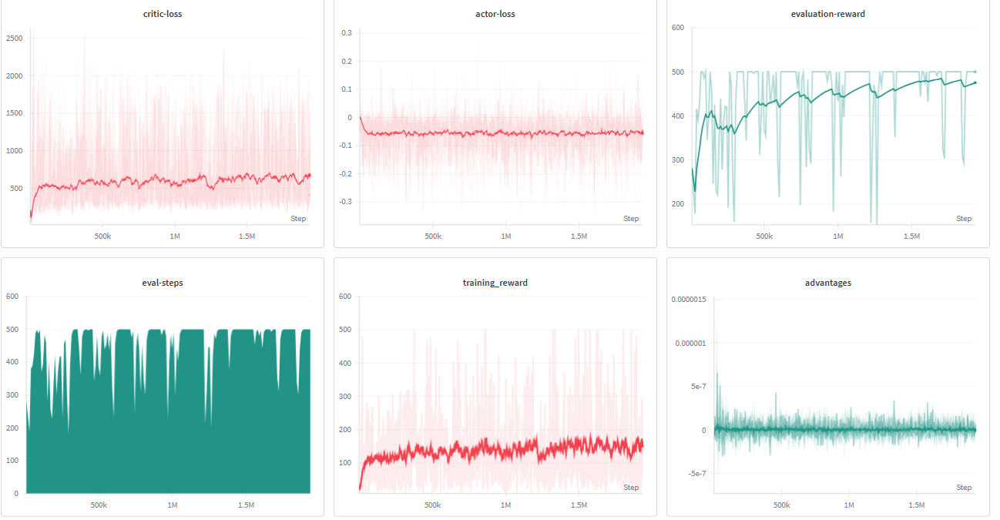

# REINFORCE with Baseline — CartPole-v1

A PyTorch implementation of the **REINFORCE with Baseline** algorithm trained on `CartPole-v1`. This is the classical Monte Carlo policy gradient method augmented with a learned value baseline to reduce the variance of gradient estimates — tracked end-to-end with Weights & Biases. 
**It is also called Monte Carlo (MC) policy-gradient method**

---

## Overview

| Property | Detail |
|---|---|
| **Algorithm** | REINFORCE with Baseline |
| **Environment** | `CartPole-v1` (Gymnasium) |
| **Return Estimation** | Full Monte Carlo — `G_t = Σ γ^k · r_{t+k}` |
| **Baseline** | Learned state-value function `V(s)` (critic) |
| **Bootstrapping** | None — pure Monte Carlo rollouts |
| **Advantage Normalization** | Yes — zero-mean, unit-variance per episode |
| **Entropy Regularization** | No |
| **Update Style** | One full episode → single gradient update |
| **Experiment Tracking** | Weights & Biases (W&B) |

---

## How This Differs from A2C

This implementation is often confused with A2C because both use an actor and a critic. The critical difference is in how the return is computed:

| Property | REINFORCE with Baseline | A2C (TD) |
|---|---|---|
| Return `G_t` | Full Monte Carlo sum | 1-step TD bootstrap: `r + γ·V(s')` |
| Bias | Zero (unbiased) | Some bias from bootstrapping |
| Variance | High (mitigated by baseline) | Low |
| Requires episode completion | Yes — must wait for `done` | No — can update mid-episode |
| Baseline role | Variance reduction only | Both variance reduction and bootstrapping |

The baseline `V(s_t)` does not change the *expected* gradient — it only reduces its variance. This is mathematically provable and is the key insight behind REINFORCE with Baseline.

---

## Algorithm Design

### Monte Carlo Return

After a full episode of length `T`, the discounted return from each timestep `t` is computed by summing all future rewards:

$$G_t = \sum_{k=0}^{T-t-1} \gamma^k \, r_{t+k}$$

In code, this is computed via a backwards pass:

```python
Gt = 0
for r in reversed(all_rewards):
    Gt = r + gamma * Gt
    all_Gt.insert(0, Gt)
```

This single reversed pass computes all `G_t` values in `O(T)` time — no nested loops needed.

### Advantage Estimate

The advantage subtracts the critic's value estimate from the MC return to center the gradient signal:

$$A_t = G_t - V(s_t)$$

Then normalized per episode:

$$\hat{A}_t = \frac{A_t - \mu_A}{\sigma_A + \epsilon}$$

Normalization ensures that regardless of the raw scale of returns (which can vary wildly across episodes), the gradient updates stay in a consistent magnitude range.

### Actor Loss (Policy Gradient)

The policy is updated to increase the log-probability of actions that had positive advantage over the baseline:

$$\mathcal{L}^{\text{actor}} = -\mathbb{E}_t\!\left[\log \pi_\theta(a_t \mid s_t) \cdot \hat{A}_t^{\,\text{detach}}\right]$$

The advantage is detached — the actor's gradient must not flow through `V(s_t)` into the critic's weights.

### Critic Loss (Baseline Regression)

The critic is trained to minimize the squared error between its prediction and the MC return:

$$\mathcal{L}^{\text{critic}} = \mathbb{E}_t\!\left[\left(V_\phi(s_t) - G_t^{\,\text{detach}}\right)^2\right]$$

The MC return `G_t` is also detached — it is treated as a fixed regression target, not a moving part of the computation graph.

---

## Network Architecture

Both actor and critic use independent MLPs with the same backbone:

```
Input (4,) → Linear(200) → ReLU
           → Linear(200) → ReLU
           → Linear(128) → ReLU
           → Output
```

| Network | Output | Head |
|---|---|---|
| Actor | `action_dim` logits → Softmax → Categorical | Softmax |
| Critic | Scalar `V(s)` | Linear (no activation) |

**Parameter Count**

- Actor: `4×200 + 200×200 + 200×128 + 128×2` ≈ 67k parameters
- Critic: `4×200 + 200×200 + 200×128 + 128×1` ≈ 67k parameters

---

## Hyperparameters

| Hyperparameter | Value | Role |
|---|---|---|
| `n_rollouts` | `100,000` | Total training episodes |
| `gamma` | `0.99` | Discount factor |
| `actor_lr` | `2.5e-4` | AdamW LR for actor |
| `critic_lr` | `2.5e-4` | AdamW LR for critic |
| `eval_steps` | `10,000` | Evaluate every N global steps |
| `eval_loops` | `3` | Episodes averaged per evaluation |
| `record_video` | `500,000` | Record video every N global steps |

---

## W&B Training Logs

All metrics are tracked live on Weights & Biases per rollout.

| Metric | Logged When | Description |
|---|---|---|
| `training_reward` | Every rollout | Total undiscounted reward for the training episode |
| `training-step` | Every rollout | Number of timesteps in the training episode |
| `global-steps` | Every environment step | Total environment interaction count |
| `actor-loss` | Every rollout | Policy gradient loss (should decrease and stabilize) |
| `critic-loss` | Every rollout | MSE between `V(s)` and MC return `G_t` |
| `advantages` | Every rollout | Mean normalized advantage across the episode |
| `evaluation-reward` | Every 10,000 global steps | Avg reward over 3 greedy (argmax) eval episodes |
| `eval-steps` | Every 10,000 global steps | Avg episode length during evaluation |

### Training Dashboard



> The dashboard above shows training reward growth, loss convergence, advantage trends, and evaluation reward across global steps.

---

## Training Loop — Step by Step

```
For each of n_rollouts:

  Phase 1 — Episode Collection (no gradient)
    1. Reset environment
    2. At each step: sample action from Categorical(actor logits)
    3. Store (s, a, r, s', done, log_prob)
    4. Repeat until done = True

  Phase 2 — Return Computation (no gradient)
    5. Backwards pass over rewards to compute G_t for all t
    6. G_t = r_t + gamma * G_{t+1}  (G_T = 0 at terminal)

  Phase 3 — Advantage Computation (no gradient for baseline)
    7. Compute V(s_t) for all states via critic
    8. A_t = G_t - V(s_t)
    9. Normalize: A_hat = (A - mean) / (std + 1e-9)

  Phase 4 — Gradient Updates
    10. Actor loss = -mean(log_pi(a|s) * A_hat.detach())
    11. Critic loss = MSE(V(s), G_t.detach())
    12. Backward + AdamW step for actor
    13. Backward + AdamW step for critic

  Phase 5 — Evaluation
    14. Every 10,000 global steps: greedy eval over 3 episodes
    15. Every 500,000 global steps: record video
```

---

## Key Implementation Notes

**Why use full Monte Carlo returns instead of TD?**
Monte Carlo returns are unbiased — `G_t` is the true discounted sum of future rewards actually received. TD targets introduce bootstrapping bias because they substitute `V(s')` for the unknown future. On short episodes like CartPole, MC returns are tractable and preferable from a theoretical standpoint, at the cost of higher variance.

**Why does the baseline not introduce bias?**
Subtracting any function `b(s_t)` that does not depend on the action from the advantage leaves the expected policy gradient unchanged. This follows from the fact that `E[∇log π(a|s) · b(s)] = 0` for any baseline `b(s)`. The critic's value function `V(s_t)` is a state-only function, so this condition holds exactly.

**Why detach `G_t` in the critic loss?**
`G_t` is pre-computed from the raw reward sequence and is a fixed scalar target. If it were not detached, PyTorch would attempt to backpropagate through the reward accumulation loop — which is meaningless and would corrupt the computation graph.

**Why detach `A_hat` in the actor loss?**
The advantage `A_t = G_t - V(s_t)` contains `V(s_t)` which is a function of critic parameters `φ`. If not detached, the actor gradient would flow through `V(s_t)` into the critic — creating an unintended coupling where the actor's update modifies the critic's weights as a side effect.

**How does this differ from vanilla REINFORCE?**
Vanilla REINFORCE uses `G_t` directly as the weight on the log-probability gradient. REINFORCE with Baseline replaces `G_t` with `G_t - V(s_t)`. Since `V(s_t)` is the critic's best estimate of the expected return from `s_t`, the difference isolates whether the specific episode's outcome was better or worse than average — this is the variance reduction.

---

## Getting Started

### Install Dependencies

```bash
git clone https://github.com/ajheshbasnet/reinforcement-learning-agents.git
cd "reinforcement-learning-agents/Reinforce with Baseline (MC)"
pip install torch gymnasium wandb tqdm
```

### Train

```python
# Set your W&B API key inside wandb_runs()
wandb.login(key="YOUR_API_KEY")

# Run the notebook
Run all the cell after switching to T4GPU so that the training happens bit quickly.
```

Model weights are saved to `actor.pt` after training.

### Evaluate

```python
actornet.load_state_dict(torch.load("actor.pt"))
evaluation(actornet, record_video=True)
# Videos saved to videos/<global_step>/
```

---

## Project Structure

```
Reinforce with Baseline (MC)/
├── src/Reinforce Algorithm.ipynb.ipynb   # Full training notebook
├── actor.pt                   # Saved actor weights (post-training)
├── videos/ rl-video-episode-0.mp4             # Recorded evaluation episodes
└── static/
    └── wandblogged.png        # W&B training dashboard screenshot
```

---

## References

- Williams (1992) — [Simple Statistical Gradient-Following Algorithms for Connectionist Reinforcement Learning](https://link.springer.com/article/10.1007/BF00992696)
- Sutton & Barto — [Reinforcement Learning: An Introduction, Chapter 13](http://incompleteideas.net/book/the-book-2nd.html)

---

## Author

**Ajhesh Basnet**
- GitHub: [@ajheshbasnet](https://github.com/ajheshbasnet)
- Full Repository: [reinforcement-learning-agents](https://github.com/ajheshbasnet/reinforcement-learning-agents)
- W&B Entity: `ajheshbasnet-kpriet`
