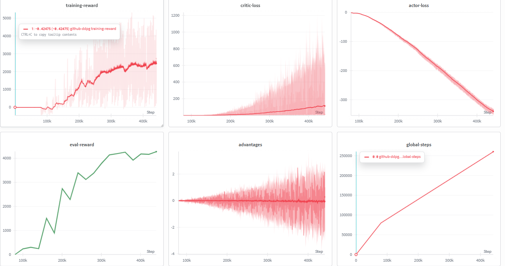

# Twin Delayed Deep Deterministic Policy Gradient (TD3) — Ant-v5

A PyTorch implementation of **TD3** trained on the `Ant-v5` continuous control environment from MuJoCo. TD3 extends DDPG with three core improvements — twin critics, delayed policy updates, and target policy smoothing — all of which directly address the overestimation and instability problems that plague vanilla DDPG in high-dimensional continuous action spaces.

---

## Overview

| Property | Detail |
|---|---|
| **Algorithm** | Twin Delayed Deep Deterministic Policy Gradient (TD3) |
| **Environment** | `Ant-v5` (MuJoCo via Gymnasium) |
| **Action Space** | Continuous, 8-dimensional (joint torques) |
| **Observation Space** | 27-dimensional proprioceptive state |
| **Exploration** | Gaussian action noise (`σ = 0.1`) at training time |
| **Target Policy Smoothing** | Clipped noise added to target actions (`σ = 0.2`, clip `±0.5`) |
| **Twin Critics** | Two independent Q-networks, TD target uses `min(Q1, Q2)` |
| **Policy Update Frequency** | Actor updated every 2 critic steps |
| **Soft Target Updates** | Polyak averaging (`τ = 0.001`) on all 3 target networks |
| **Replay Buffer** | Experience replay (capacity: 800,000) |
| **Training Start** | After 50,000 environment steps |
| **Gradient Clipping** | `max_norm = 1.0` on all networks |
| **Experiment Tracking** | Weights & Biases (W&B) |

---

## Algorithm Design

### Why TD3 over DDPG?

DDPG suffers from a well-known pathology: the Q-function systematically overestimates action values, because the actor is trained to maximize the critic's output — and the critic is trained on targets that themselves involve the actor's maximization. This feedback loop causes the Q-values to diverge upward, producing an overconfident critic that misleads the actor. TD3 introduces three targeted fixes.

---

### Fix 1 — Twin Critics (Clipped Double Q-Learning)

Two independent critic networks — `Q1` and `Q2` — are trained simultaneously. The TD target is computed using the **minimum** of the two target critics:

$$y_t = r_t + \gamma \cdot \min\!\left(Q_{\theta_1^-}(s', \tilde{a}'),\; Q_{\theta_2^-}(s', \tilde{a}')\right) \cdot (1 - d_t)$$

Taking the minimum is a conservative estimate. Even if one critic overestimates, the other acts as a corrective lower bound. Over training, this prevents runaway Q-value inflation.

---

### Fix 2 — Target Policy Smoothing

Rather than bootstrapping off the target actor's deterministic action, TD3 adds clipped Gaussian noise to the target action before passing it through the target critics:

$$\tilde{a}' = \pi_{\theta^-}(s') + \text{clip}\!\left(\mathcal{N}(0,\, \sigma_{\text{policy}}^2),\; -c,\; +c\right)$$

with `σ_policy = 0.2` and `c = 0.5`. This smooths the Q-landscape over a small neighborhood of actions, making the value estimate more robust to sharp peaks that the actor might exploit in ways that do not generalize.

---

### Fix 3 — Delayed Policy Updates

The actor and all three target networks are updated only every `actor_freq = 2` critic steps. Critics are updated at every training step, but the actor is held frozen in between. This ensures the critics have converged to a more accurate Q-estimate before the actor takes a gradient step — preventing the actor from chasing a noisy, unstable signal.

---

### Soft Target Updates (Polyak Averaging)

All three target networks — `TargetActor`, `TargetCritic1`, `TargetCritic2` — are updated via exponential moving average:

$$\theta^- \leftarrow \tau \cdot \theta + (1 - \tau) \cdot \theta^-$$

with `τ = 0.001`. This is a very slow blend — only 0.1% of the online weights are incorporated per step — giving the target networks the stability needed to produce consistent regression targets.

---

### Actor Loss

The actor is trained to maximize the minimum of both online critics evaluated at the actor's current action:

$$\mathcal{L}^{\text{actor}} = -\mathbb{E}_t\!\left[\min\!\left(Q_{\theta_1}(s_t, \pi_\theta(s_t)),\; Q_{\theta_2}(s_t, \pi_\theta(s_t))\right)\right]$$

Note that this uses the **online critics** (not targets) and the **online actor**. The gradient flows through the critic into the actor — this is the deterministic policy gradient mechanism.

---

### Critic Architecture

The critic takes a concatenation of state and action as input:

```python
x = torch.cat([state, action], dim=1)  # (B, obs_dim + action_dim)
```

This allows the critic to model `Q(s, a)` jointly, learning interaction effects between state features and continuous action dimensions.

---

## Network Architecture

```
Actor:
  Input (27,) → Linear(512) → ReLU → Linear(256) → ReLU → Linear(8) → Tanh
  Output: action in [-1, +1]^8

Critic (×2, independent):
  Input (27 + 8 = 35,) → Linear(512) → ReLU → Linear(256) → ReLU → Linear(1)
  Output: scalar Q(s, a)
```

The `Tanh` output on the actor bounds actions to `[-1, 1]`, which matches the normalized action space of MuJoCo environments.

**Parameter Count (per network)**

- Actor: `27×512 + 512×256 + 256×8` ≈ 144k parameters
- Critic: `35×512 + 512×256 + 256×1` ≈ 149k parameters
- Total across all 6 networks: ≈ **886k parameters**

---

## Hyperparameters

| Hyperparameter | Value | Role |
|---|---|---|
| `n_rollouts` | `100,000` | Total episode rollouts |
| `max_steps` | `1,000` | Max steps per training episode |
| `eval_max_steps` | `800` | Max steps per eval episode |
| `buffer_size` | `800,000` | Replay buffer capacity |
| `batch_size` | `512` | Mini-batch size per gradient update |
| `start_training` | `50,000` | Steps before first gradient update |
| `training_step` | `2` | Critic updated every N global steps |
| `actor_freq` | `2` | Actor updated every N critic updates |
| `gamma` | `0.99` | Discount factor |
| `tau` | `0.001` | Polyak averaging coefficient |
| `action_sigma` | `0.1` | Gaussian noise std for exploration |
| `policy_noise` | `0.2` | Target policy smoothing noise std |
| `noise_clip` | `0.5` | Clipping range for target policy noise |
| `actor_lr` | `2.5e-4` | AdamW LR for actor |
| `critic_lr` | `2.5e-4` | AdamW LR for both critics |
| `eval_steps` | `10,000` | Evaluate every N global steps |
| `eval_loops` | `3` | Episodes averaged per evaluation |
| `record_video` | `500,000` | Record video every N global steps |

---

## W&B Training Logs

All metrics are tracked live on Weights & Biases.

| Metric | Logged When | Description |
|---|---|---|
| `actor-loss` | Every `training_step` (post warm-up) | Negative mean Q — should decrease (become more negative) as policy improves |
| `critic-loss1` | Every `training_step` | MSE between `Q1` and the twin-critic TD target |
| `critic-loss2` | Every `training_step` | MSE between `Q2` and the twin-critic TD target |
| `advantages` | Every `training_step` | Mean of `target_Q − min(Q1, Q2)` — proxy for how much the target network leads the online critics |
| `training-reward` | Every global step | Cumulative undiscounted reward for the current training episode |
| `global-steps` | Every global step | Total environment interaction steps |
| `memory` | Every global step | Current replay buffer occupancy |
| `eval-reward` | Every 10,000 global steps | Avg reward over 3 deterministic (no noise) eval episodes |

### Training Dashboard



> The dashboard above shows Q-value loss convergence for both critics, actor loss trends, advantage estimates, training rewards, and evaluation reward progression across global steps.

---

## Training Loop — Step by Step

```
For each of n_rollouts:
  Reset environment

  While not done:
    1. Actor produces deterministic action: a = π(s)
    2. Add exploration noise: a ← a + N(0, σ²), clamp to [-1, 1]
    3. Step environment → (s', r, done)
    4. Store (s, a, r, s', done) in replay buffer
    5. Increment global_steps

    If global_steps >= 50,000 AND global_steps % 2 == 0:
      a. Sample batch of 512 from replay buffer
      b. Target actor computes next actions at s'
      c. Add clipped smoothing noise to next actions
      d. Compute min(TargetQ1, TargetQ2) → TD target y
      e. Update Critic1: MSE(Q1(s,a), y)
      f. Update Critic2: MSE(Q2(s,a), y)
      g. Clip gradients to max_norm=1.0 for both critics

      If global_steps % actor_freq == 0:
        h. Actor loss = -mean(min(OnlineQ1, OnlineQ2)(s, π(s)))
        i. Update actor, clip gradients
        j. Soft update: TargetActor ← τ·Actor + (1-τ)·TargetActor

      k. Soft update: TargetCritic1 and TargetCritic2

    If global_steps % 10,000 == 0:
      l. Run greedy evaluation (3 episodes, no noise)
```

---

## Key Implementation Notes

**Why clone `states_b` before the actor update?**
`states_b` is used twice: once for the critic update and once for the actor update. After the critic backward pass, the computation graph attached to `states_b` may have residual state. Calling `states_b.clone()` creates a fresh tensor with a clean graph, preventing gradient interference between the two update steps.

**Why apply gradient clipping (`max_norm = 1.0`)?**
The Ant environment has a 27-dimensional observation and 8-dimensional action space. Q-function gradients in high-dimensional continuous control can spike sharply, especially early in training when the replay buffer contains mostly random transitions. Clipping to norm 1.0 prevents single large gradient steps from destabilizing the critic.

**Why delay actor updates by `actor_freq = 2`?**
Each actor gradient step directly depends on the quality of the critic's Q-estimates. If the critic has not yet had time to reduce its error, the actor gradient is misleading. Updating the critic twice per actor step ensures the value estimates are sharper before the policy moves.

**Why use `τ = 0.001` instead of a larger value?**
The Ant task has long horizons and high-dimensional dynamics. A small `τ` keeps the target networks almost frozen relative to the online networks, providing a stable regression target. Larger `τ` would cause the targets to chase the online network too aggressively, reintroducing the instability TD3 is designed to avoid.

**What does `advantages` measure in the logs?**
The logged `advantages = mean(target_Q − min(Q1, Q2))` measures how far ahead the target critics are relative to the online critics. Early in training this should be positive (target leads online). As training stabilizes, this gap narrows and fluctuates around zero.

---

## Getting Started

### Install Dependencies

```bash
git clone https://github.com/ajheshbasnet/reinforcement-learning-agents.git
cd reinforcement-learning-agents/TD3-Ant-V5
pip install "gymnasium[mujoco]" mujoco torch wandb tqdm
```

### Train

```python
# Set your W&B API key inside wandb_runs()
wandb.login(key="YOUR_API_KEY")

# Open and run the notebook
jupyter notebook src/TD3-Ant-V5.ipynb
```

### Evaluate with Video

```python
actornet.load_state_dict(torch.load("actor.pt"))
evaluation(actornet, record_video=True)
# Videos saved to videos/<timestamp>/
```

---

## Project Structure

```
TD3-Ant-V5/
├── src/
│   └── TD3-Ant-V5.ipynb       # Full training notebook
├── videos/ TD3.mp4                    # Recorded evaluation episodes
└── static/
    └── wandblogged.png        # W&B training dashboard screenshot
```

---

## References

- Fujimoto et al. (2018) — [Addressing Function Approximation Error in Actor-Critic Methods](https://arxiv.org/abs/1802.09477)
- Lillicrap et al. (2015) — [Continuous Control with Deep Reinforcement Learning (DDPG)](https://arxiv.org/abs/1509.02971)
- MuJoCo Ant-v5 — [Gymnasium Documentation](https://gymnasium.farama.org/environments/mujoco/ant/)

---

## Author

**Ajhesh Basnet**
- GitHub: [@ajheshbasnet](https://github.com/ajheshbasnet)
- Full Repository: [reinforcement-learning-agents](https://github.com/ajheshbasnet/reinforcement-learning-agents)
- W&B Entity: `ajheshbasnet-kpriet`
