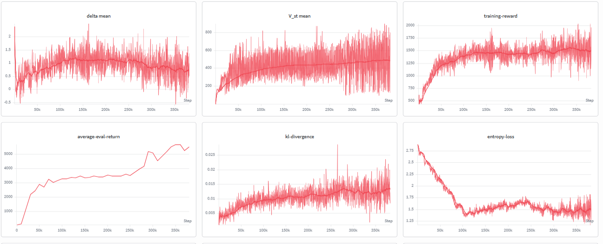
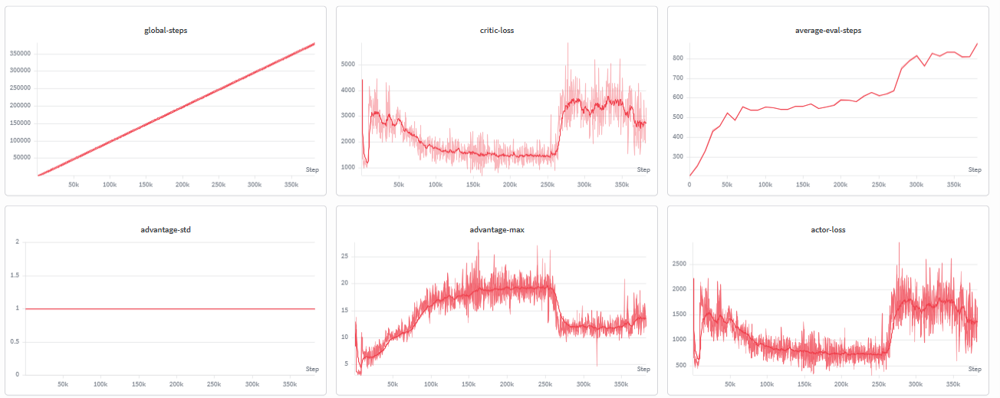

# Vectorized Environment PPO — Atari RiverRaid

Proximal Policy Optimization (PPO) trained on the Atari 2600 game **RiverRaid** using a vectorized parallel environment setup. The agent learns directly from raw pixel observations through a convolutional neural network policy, trained end-to-end using the actor-critic formulation of PPO.

---

## Table of Contents

- [Overview](#overview)
- [Algorithm](#algorithm)
- [Environment](#environment)
- [Repository Structure](#repository-structure)
- [Training Charts](#training-charts)
- [Results](#results)
- [Requirements](#requirements)
- [Usage](#usage)
- [References](#references)

---

## Overview

This project implements PPO with a vectorized environment wrapper to parallelize rollout collection across multiple environment instances simultaneously. Vectorization significantly improves sample throughput and training stability by providing a more diverse and decorrelated batch of experiences at each update step.

The agent is evaluated on **ALE/RiverRaid-v5**, a classic Atari benchmark where the agent pilots a jet fighter, managing fuel and destroying enemy targets while navigating a scrolling river.

---

## Algorithm

The implementation follows the original PPO-Clip objective:

```
L_CLIP(theta) = E_t [ min( r_t(theta) * A_t,  clip(r_t(theta), 1-eps, 1+eps) * A_t ) ]
```

Where:
- `r_t(theta)` is the probability ratio between the new and old policy
- `A_t` is the Generalized Advantage Estimate (GAE)
- `eps` is the clipping threshold (typically 0.1 or 0.2)

The full loss combines the clipped policy objective, a value function loss, and an entropy bonus:

```
L_total = L_CLIP - c1 * L_VF + c2 * H[pi]
```

**Key design choices:**
- Vectorized rollout collection across N parallel environments
- Convolutional feature extractor shared between actor and critic heads
- GAE-Lambda for advantage estimation
- Frame stacking and grayscale preprocessing following standard Atari conventions
- Mini-batch updates with multiple epochs over each collected rollout buffer

---

## Environment

| Property          | Value                                          |
|-------------------|------------------------------------------------|
| Environment       | ALE/RiverRaid-v5                               |
| Observation       | Raw RGB pixels (210 x 160 x 3)                 |
| Preprocessed Obs  | Grayscale, resized, stacked                    |
| Action Space      | Discrete (18 actions)                          |
| Framework         | Gymnasium / Stable-Baselines3 or custom PyTorch|

---

## Repository Structure

```
Vectorized Env PPO RiverRaid/
│
├── river-raid.ipynb              # Main training and evaluation notebook
│
├── static/
│   ├── chart1.png                # WandB training chart (episodic reward)
│   └── chart2.png                # WandB training chart (policy / value loss)
│
└── videos&weights/
    ├── actornetwork.pth          # Saved actor network weights (PyTorch)
    └── result.mp4                # Recorded gameplay video of the trained agent
```

---

## Training Charts

The following charts were logged via **Weights and Biases (WandB)** during training.

**Episodic Reward over Training Steps**



**Policy and Value Loss over Training Steps**



---

## Results

The trained agent demonstrates stable navigation behavior, fuel management, and enemy engagement in the RiverRaid environment. The saved weights and a recorded gameplay rollout are available under `videos&weights/`.

| Artifact               | Path                                |
|------------------------|-------------------------------------|
| Actor network weights  | `videos&weights/actornetwork.pth`   |
| Gameplay recording     | `videos&weights/result.mp4`         |

---

## Requirements

```
python >= 3.8
torch
gymnasium[atari]
ale-py
stable-baselines3
wandb
opencv-python
numpy
```

Install all dependencies with:

```bash
pip install torch gymnasium[atari] ale-py stable-baselines3 wandb opencv-python numpy
```

---

## Usage

Open and run the training notebook:

```bash
jupyter notebook river-raid.ipynb
```

To load the saved weights and run inference on a new environment instance:

```python
import torch
from your_model_module import ActorNetwork   # replace with your actual import

model = ActorNetwork(input_shape, n_actions)
model.load_state_dict(torch.load("videos&weights/actornetwork.pth"))
model.eval()
```

---

## References

- Schulman, J. et al. (2017). *Proximal Policy Optimization Algorithms*. [arXiv:1707.06347](https://arxiv.org/abs/1707.06347)
- Mnih, V. et al. (2015). *Human-level control through deep reinforcement learning*. Nature.
- [OpenAI Gymnasium — Atari Environments](https://gymnasium.farama.org/environments/atari/)
- [Weights and Biases](https://wandb.ai)

---

## Author

**Ajhesh Basnet**  
GitHub: [ajheshbasnet](https://github.com/ajheshbasnet)
